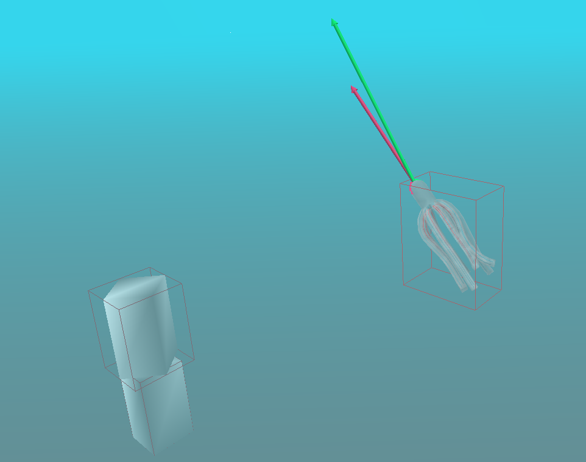

# Разработка алгоритма процедурной анимации осьминога

Данная работа реализует практическую часть выпускной квалификационной работы по специальности "Технологии разработки компьютерных игр". Полный текст работы можно увидеть [здесь](https://github.com/elenastotskaya/octopus-animation/blob/master/Octopus%20Procedural%20Animation.pdf).  
Целью работы была разработка алгоритма процедурной анимации осьминога, имитирующей его естественное движение, с возможностью в перспективе адаптировать его для использования в видеоиграх.  
В основе работы лежит проект [SoftCon: Simulation and Control of Soft-Bodied Animals with Biomimetic Actuators](https://github.com/seiing/SoftCon) за авторством Sehee Min и других.  
Исходное описание проекта от авторов, включающее ссылки на их публикации по теме, находится в файле [readme_original](https://github.com/elenastotskaya/octopus-animation/blob/master/readme_original.md).  
В исходном проекте была реализована физическая модель плавания осьминога, основанная на методе конечных элементов и моделировании нервных импульсов в мышцах. Для реализации целенаправленного и управляемого движения в программе используется обучение с подкреплением на основе библиотеки [OpenAI Baselines](https://github.com/openai/baselines).  
Для решения поставленной задачи в программу были добавлены следующие модификации и улучшения:  
- Два альтернативных варианта дополнительного параметра для обучения с подкреплением, включенных для решения проблемы спонтанного вращения осьминога вокруг своей оси
- Загрузка препятствий в сцену
- Базовый алгоритм обработки коллизий с использованием ограничивающих параллелепипедов
- Пользовательское управление
- Адаптация программы для более современных версий операционной системы и библиотек
Для использования современных библиотек, помимо изменений в исходном коде данного проекта, был создан отдельный форк библиотеки [Stable Baselines)](https://github.com/elenastotskaya/stable-baselines), представляющий собой комбинацию OpenAI Baselines и ее более поздней модификации [hill-a/stable-baselines](https://github.com/hill-a/stable-baselines), адаптированную под современный Python.


<p align="center">
Пример работы программы с добавлением препятствий и ограничивающих параллелепипедов.
</p>

## Установка и запуск программы

Рекомендованная операционная система для запуска - Ubuntu 24.04

Аналогично исходной инструкции:
```
sudo apt-get update
sudo apt-get install build-essential cmake-curses-gui git
sudo apt-get install libeigen3-dev freeglut3-dev libtinyxml-dev libpython3-dev python3-numpy libopenmpi-dev
```

Скачать последнюю версию Boost по ссылке: [https://www.boost.org/users/history/version_1_85_0.html](https://www.boost.org/users/history/version_1_85_0.html)  
Распаковать: ```tar -xvf boost_1_85_0.tar.gz```  
Установить Boost:
```cd boost_1_85_0
sudo ./bootstrap.sh --with-python=python3
sudo ./b2 --with-python --with-filesystem --with-system install
```

### Создание виртуального окружения:
```
sudo apt-get install python3.12-venv
mkdir -p ~/.venvs
python3 -m venv ~/.venvs/softcon_venv
```

### Установка модулей Python:
```
~/.venvs/softcon_venv/bin/python -m pip install numpy scipy matplotlib tensorflow mpi4py OpenCV-Python gymnasium ipython
```

### Установка более ранней версии Keras для доступа к legacy функциям:
```
~/.venvs/softcon_venv/bin/python -m pip install tf-keras~=2.16
```
   
### Установка Stable Baselines:
```
sudo apt-get update && sudo apt-get install cmake zlib1g-dev
git clone https://github.com/elenastotskaya/stable-baselines.git
cd stable-baselines
~/.venvs/softcon_venv/bin/python -m pip install -e .
```

### Установка проекта:
```
cd ..
git clone https://github.com/elenastotskaya/octopus-animation.git
```

### Сборка:
```
cd octopus-animation
mkdir build
cd build 
cmake ..
make -j
```

### Запуск демонстрационного примера:
```
./render/render
```

Для обучения или запуска обученной модели необходимо сначала активировать виртуальное окружение:
```
source ~/.venvs/softcon_venv/bin/activate
```

### Запуск обученной модели:
```
./render/render (название_модели)
```
Уже обученные модели:
- Модель с ограничением на разницу высоты: ```train_20240426_014248_1900```
- Модель с ограничением на разницу скоростей: ```train_20240501_011254_2550```
- Модель с обоими ограничениями: ```train_20240504_004655_3860```

Для обученных моделей реализовано управление движением:  
W - поворот вверх, S - вниз, A - влево, D - вправо (в относительной системе координат осьминога)  
Регулирование скорости движения в этих моделях не реализовано.

### Обучение:
```
cd octopus-animation/learn
mpirun -np (число-потоков) python3 -m run --type=train
```

### Добавление препятствий на сцену:
Скопировать модель в формате .obj в папку data/meshes.  
В файле data/meshes/mesh_list.txt указать параметры в соответствии с примером:
```
box2.obj
t 0 1.5 -6.0 s 5.0 3.0 1.0 r 0.8 0.0 1.0 0.0
```
Первая строка - название файла модели  
Вторая строка - параметры преобразований, применяемых к модели:  
t - смещение, задаются значения смещения по трем координатам  
r - поворот, первое число - угол поворота, следующие - ось вращения, заданная как три координаты вектора  
s - масштабирование, задаются коэффициенты масштабирования по трем координатам  
Все параметры опциональные и могут указываться в любом порядке (если не используется ни один параметр, оставить пустую строку перед следующим названием файла)
